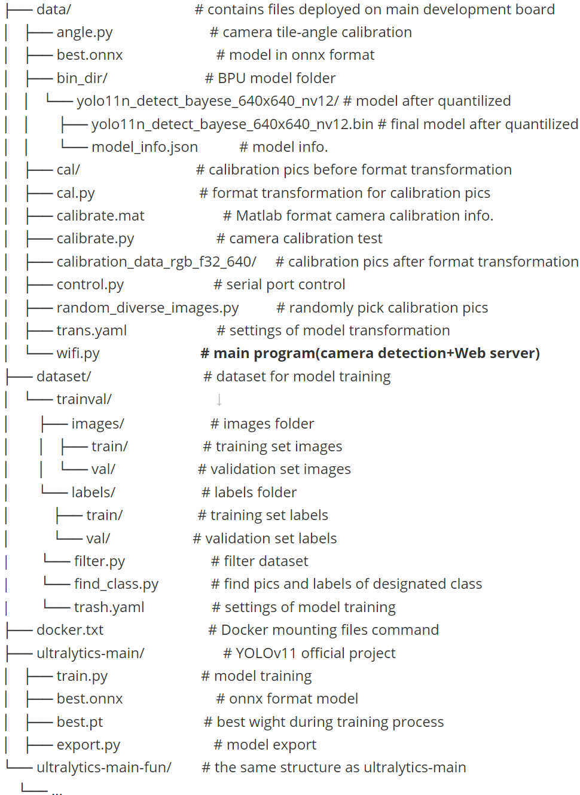
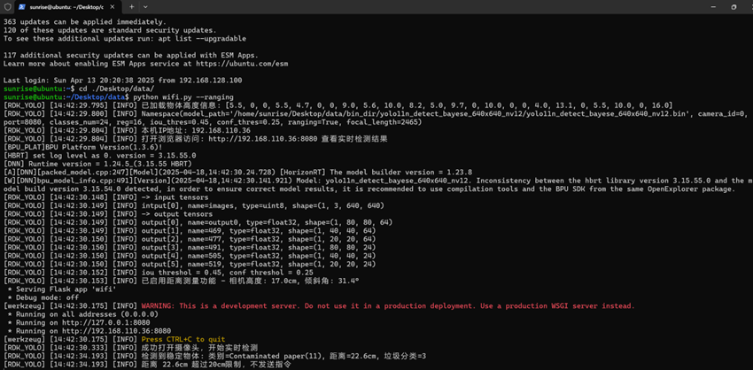
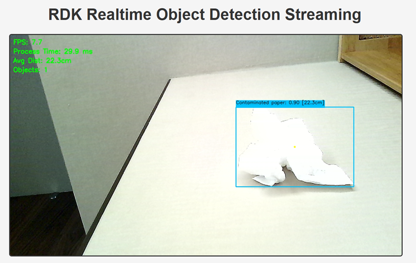

# Intelligent-Robot-Arm
This is an repository of an intelligent waste sorting robot arm, as my final year project. The system mainly consists of three modules, a camera (OV5640 USB), a main development board (D-Robotics RDK-X5), and a robotic arm and its controller (Jibot1-STM32). This project combines object recognition models, monocular ranging and inverse kinematics to achieve simple waste picking and sorting.


## Hardware

* Camera: OV5640 USB camera
* Main development board: D-Robotics RDK-X5, for more product details please refer to the [website home page](https://developer.d-robotics.cc/rdkx5)
* Robotic arm: Jibot1-STM32 by Zhongling Technology, for more product details please refer to the [item details page on Taobao](https://item.taobao.com/item.htm?id=534137774492&pisk=gnJrYkqP_YHyIf7RZK6U_LBjFcBRU9u6Kp_CxHxhVabkdbHEYUY5tJGRF6WeoZ95P36l-J8BALTBxpsHLTpXNJ_Sy9-H59us5AM623QdKVg_9sAY2OjQqW4CxS2cdMW1QBIH23BdKQxpnVt8Y96F5kjh-mWcYGqlK_fliSbAYJ4H-af0oGSOK9YhtnXc2GI3qJVuomS1vJjlr840oGIgqMYhKm-ckMXhqeXngX6hBPsGZDs8dmKLNs1PS3b4QnpVqqbZBZ2HbKjlapxluntX3g5PS6b0La9klHvWeshzZ9KX_eRHSqN5rCSwu1Or788wyMxFxUkTbZvyYK5JGzVlbT7PsLY0X-KNtIJVFL0L6ntVr1WXGj35OT8y6NCoMqLe0aTHUs4rlwO6cLf2Sqw2J6RHFtvooASroyIDYCppayVFZiIV5mo22Bh66ge40kVL9_EA0NiRtWFdZiIV5mo49WC-ki7s26f..&spm=a21xtw.29978518.0.0)

For more detailed description of hardware used in the project, please refer to ***Project.pdf***


## Project Structure




## Run

If you would like to use your own model trained on other dataset for detection, please refer to the ***Project.pdf*** or other online tutorials for guidance.

* Burn the inverse kinematics program (.hex file in ***Jibot1-32\OUT***) to robot arm.

* File transfer: Copy the files in ***data*** folder to main developoment board.

* If you have modified or changed the dataset, make sure to change the parameters for number of classes and their names in ***wifi.py***:

  ~~~python
  def postProcess(self, outputs: list[np.ndarray]) -> tuple[list]:
          begin_time = time()
          try:
              # reshape
              s_bboxes = outputs[0].reshape(-1, 64)
              m_bboxes = outputs[1].reshape(-1, 64)
              l_bboxes = outputs[2].reshape(-1, 64)
              s_clses = outputs[3].reshape(-1, 24)
              m_clses = outputs[4].reshape(-1, 24)
              l_clses = outputs[5].reshape(-1, 24)
  			```
              
  coco_names = [
      'Disposable Fast Food Box', 'Book Paper', 'Plastic Utensils', 'Plastic Toys', 'Dry Battery', 'Express Paper Bag', 'Plug Wire', 'Can', 'Peel and Pulp', 'Stuffed Toy', 'Defiled Plastic', 'Contaminated paper', 'Toilet care products', 'Cigarette butts', 'Carton box', 'Tea residue', 'Cai Bang Cai Ye', 'Egg Shell', 'Sauce Bottle', 'Ointment', 'Expired Medicine', 'Metal Food Cans', 'edible oil drums', 'drink bottles'
      ]
  ~~~

* Camera and tilt angle calibration: 

   1. Take enough pictures of calibration plane (printed chessboard) from different angles and distances, 

   2. Import to Camera Calibrator in Matlab and calibrate to derive camera parameters. 

   3. Write the parameters matrix in ***angle.py***, and make sure the camera is then sticked to a stable position on the robot arm.

   4. Mesure the height of camera relative to the basement of robot arm (H) , and if there is height difference between the desktop and basement, also fill in the parameters (h).

   5. Take pictures of calibration plane on desktop from different distances again, and make sure the chessboard on plane can be fully captured by the camera and it's basically perpendicular to the camera.

   6. Run ***angle.py*** to derive the tilt angle.

      ```python
      if __name__ == "__main__":
          # Camera parameters
          camera_matrix = np.array([
              [2465.128986762485, 0, 984.7157440488494], 
              [0, 2465.442899090040, 540.7101182076190], 
              [0, 0, 1]
          ])
          dist_coeffs = [0.004625970045023, -0.0008902630420674212, -0.039376100278451, 0.563886970534354, 0]
          H = 17.0
          h = 1.0  
      
          calibrator = TiltCalibrator(camera_matrix, dist_coeffs, H)
      
          # input: list of location of images and their corresponding distance
          img_paths = [
              "C:/Users/Feng/Pictures/Camera Roll/28.8.jpg", 
              "C:/Users/Feng/Pictures/Camera Roll/29.6.jpg",
              "C:/Users/Feng/Pictures/Camera Roll/30.0.jpg",
              "C:/Users/Feng/Pictures/Camera Roll/31.0.jpg",
              "C:/Users/Feng/Pictures/Camera Roll/31.8.jpg",
              "C:/Users/Feng/Pictures/Camera Roll/32.9.jpg",
              "C:/Users/Feng/Pictures/Camera Roll/34.7.jpg",
              "C:/Users/Feng/Pictures/Camera Roll/36.0.jpg",
              "C:/Users/Feng/Pictures/Camera Roll/37.2.jpg",
              "C:/Users/Feng/Pictures/Camera Roll/38.0.jpg"
          ]
          D_ref_list = [28.8, 29.6, 30.0, 31.0, 31.8, 32.9, 34.7, 36.0, 37.2, 38.0]  #cm
      ```

* Change parameters in ***wifi.py*** if required (heights, tilt angle, focal length of camera and number of class):

  ```python
  def main():
      H = 17.0    # height of camera (cm)
      theta = np.deg2rad(31.41)  # tilt angle of camera
      h = 1.0    # height of the basement of robot arm relative to the plane where objects posit (cm)
      object_heights = load_object_heights() #load the heights of testing objects
      
      parser = argparse.ArgumentParser()
      parser.add_argument('--model-path', type=str, default='/home/sunrise/Desktop/data/bin_dir/yolo11n_detect_bayese_640x640_nv12/yolo11n_detect_bayese_640x640_nv12.bin', 
                          help="""Path to BPU Quantized *.bin Model.""") 
      parser.add_argument('--camera-id', type=int, default=0, help='Camera device ID.')
      parser.add_argument('--port', type=int, default=8080, help='Web server port.')
      parser.add_argument('--classes-num', type=int, default=24, help='Classes Num to Detect.')
      parser.add_argument('--reg', type=int, default=16, help='DFL reg layer.')
      parser.add_argument('--iou-thres', type=float, default=0.45, help='IoU threshold.')
      parser.add_argument('--conf-thres', type=float, default=0.25, help='confidence threshold.')
      parser.add_argument('--ranging', action='store_true', help='Enable distance ranging for all objects')
      parser.add_argument('--focal-length', type=float, default=2465, help='Camera focal length in pixels')
  ```

* Form a simple list of objects' height: Create a .txt file which contains the height of testing objects, where each class takes a seperate line (the height data must be put at the last of its line and their order should be assigned with the classes). Remember to change the file name:

   ```python
   def load_object_heights():
       object_heights = [0] * len(coco_names)  # 0 as default for blank line
       try:
           with open('label.txt', 'r', encoding='utf-8') as f:
   ```

* Run the ***wifi.py*** on board with designated parameters (--ranging is for distance measurement, can be closed) and check the video stream on development PC:

  ```cmd
  python wifi.py --ranging
  ```

  The web server address will be printed on command line (Running on [address]:[port]):

  

​	Access with browser:

​		


## Details

For design details and practices explanation of the project, please read the ***Project.pdf*** documentation.
