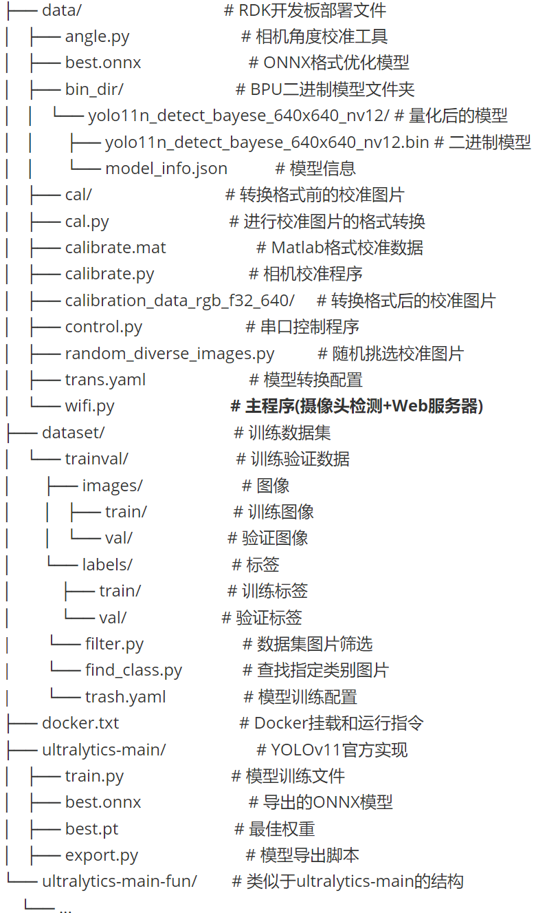

# 智能垃圾分类机械臂

[English](README.md) | [中文](README_zh.md)

这是一个智能垃圾分类机械臂项目，作为我的毕业设计。系统主要由三个模块，摄像头（OV5640 USB），主开发板（D-Robotics RDK-X5），以及机械臂及其控制器（Jibot1-STM32）共同组成。该项目通过融合物体识别模型，单目测距和逆运动学等方法来实现简单的垃圾夹取和分类。


## 硬件

* 摄像头：OV5640 USB摄像头；
* 主开发板：地瓜机器人RDK-X5，更多产品规格和参数等可参考[官网介绍](https://developer.d-robotics.cc/rdkx5)；
* 机械臂：众灵科技六自由度机械臂Jibot stm32版本，更多产品规格和参数可参考[淘宝商品详情页](https://item.taobao.com/item.htm?id=534137774492&pisk=gnJrYkqP_YHyIf7RZK6U_LBjFcBRU9u6Kp_CxHxhVabkdbHEYUY5tJGRF6WeoZ95P36l-J8BALTBxpsHLTpXNJ_Sy9-H59us5AM623QdKVg_9sAY2OjQqW4CxS2cdMW1QBIH23BdKQxpnVt8Y96F5kjh-mWcYGqlK_fliSbAYJ4H-af0oGSOK9YhtnXc2GI3qJVuomS1vJjlr840oGIgqMYhKm-ckMXhqeXngX6hBPsGZDs8dmKLNs1PS3b4QnpVqqbZBZ2HbKjlapxluntX3g5PS6b0La9klHvWeshzZ9KX_eRHSqN5rCSwu1Or788wyMxFxUkTbZvyYK5JGzVlbT7PsLY0X-KNtIJVFL0L6ntVr1WXGj35OT8y6NCoMqLe0aTHUs4rlwO6cLf2Sqw2J6RHFtvooASroyIDYCppayVFZiIV5mo22Bh66ge40kVL9_EA0NiRtWFdZiIV5mo49WC-ki7s26f..&spm=a21xtw.29978518.0.0)；

更多关于项目所用硬件的详细介绍，请参阅项目文档***Project.pdf***。


## 项目结构




## 运行

若要使用另外的数据集训练自己的模型，请参阅项目文档***Project.pdf***或参考其他互联网资料。

* 将逆运动学程序 ( ***Jibot1-32\OUT***中的.hex 文件)烧录到机械臂控制器上。

* 文件迁移：把***data***文件夹复制一份到主开发板上。

* 如果修改或使用另外的数据集，需要根据实际情况修改wifi.py中的类别数和对应名字：

  ~~~python
  def postProcess(self, outputs: list[np.ndarray]) -> tuple[list]:
          begin_time = time()
          try:
              # reshape
              s_bboxes = outputs[0].reshape(-1, 64)
              m_bboxes = outputs[1].reshape(-1, 64)
              l_bboxes = outputs[2].reshape(-1, 64)
              s_clses = outputs[3].reshape(-1, 24)
              m_clses = outputs[4].reshape(-1, 24)
              l_clses = outputs[5].reshape(-1, 24)
  			```
              
  coco_names = [
      'Disposable Fast Food Box', 'Book Paper', 'Plastic Utensils', 'Plastic Toys', 'Dry Battery', 'Express Paper Bag', 'Plug Wire', 'Can', 'Peel and Pulp', 'Stuffed Toy', 'Defiled Plastic', 'Contaminated paper', 'Toilet care products', 'Cigarette butts', 'Carton box', 'Tea residue', 'Cai Bang Cai Ye', 'Egg Shell', 'Sauce Bottle', 'Ointment', 'Expired Medicine', 'Metal Food Cans', 'edible oil drums', 'drink bottles'
      ]
  ~~~

* 相机和倾斜角标定

  1. 从不同角度和距离采集足够的标定板（打印的棋盘格，自行打印或网上购买）照片；

  2. 把这些照片导入到Matlab的相机标定器（Camera Calibrator）中并进行标定来获取相机参数；

  3. 把获得的相机参数写入******中，并确保相机被固定在机械臂上保持稳定；

  4. 测量相机相对于机械臂底座的高度（H），若底座相对于桌面有一定高度差，需要额外进行测量并填入（h）；

  5. 把标定板平放于桌面并从不同距离拍照，确保标定板上的棋盘格能被完整拍到，以及需要和相机保持平齐；

  6. 运行***angle.py***获取倾斜角。

     ```python
     if __name__ == "__main__":
         # 摄像头参数示例（需替换为实际标定结果）
         camera_matrix = np.array([
             [2465.128986762485, 0, 984.7157440488494], 
             [0, 2465.442899090040, 540.7101182076190], 
             [0, 0, 1]
         ])
         dist_coeffs = [0.004625970045023, -0.0008902630420674212, -0.039376100278451, 0.563886970534354, 0]
         H = 17.0
         h = 1.0  
     
         # 初始化标定器
         calibrator = TiltCalibrator(camera_matrix, dist_coeffs, H)
     
         # 输入数据：图像路径列表 和 对应的真实距离列表
         img_paths = [
             "C:/Users/Feng/Pictures/Camera Roll/28.8.jpg", 
             "C:/Users/Feng/Pictures/Camera Roll/29.6.jpg",
             "C:/Users/Feng/Pictures/Camera Roll/30.0.jpg",
             "C:/Users/Feng/Pictures/Camera Roll/31.0.jpg",
             "C:/Users/Feng/Pictures/Camera Roll/31.8.jpg",
             "C:/Users/Feng/Pictures/Camera Roll/32.9.jpg",
             "C:/Users/Feng/Pictures/Camera Roll/34.7.jpg",
             "C:/Users/Feng/Pictures/Camera Roll/36.0.jpg",
             "C:/Users/Feng/Pictures/Camera Roll/37.2.jpg",
             "C:/Users/Feng/Pictures/Camera Roll/38.0.jpg"
         ]
         D_ref_list = [28.8, 29.6, 30.0, 31.0, 31.8, 32.9, 34.7, 36.0, 37.2, 38.0]  #cm
     ```

* 根据实际情况修改wifi.py中的参数（高度，倾斜角，相机焦距以及类别数等）：

  ```python
  def main():
      H = 17.0    # 摄像头高度 (cm)
      theta = np.deg2rad(31.41)  # 标定后的倾斜角(弧度)
      h = 1.0    # 物体平面低于底座的高度 (cm)
      object_heights = load_object_heights() # 加载物体高度信息
      
      parser = argparse.ArgumentParser()
      parser.add_argument('--model-path', type=str, default='/home/sunrise/Desktop/data/bin_dir/yolo11n_detect_bayese_640x640_nv12/yolo11n_detect_bayese_640x640_nv12.bin', 
                          help="""Path to BPU Quantized *.bin Model.""") 
      parser.add_argument('--camera-id', type=int, default=0, help='Camera device ID.')
      parser.add_argument('--port', type=int, default=8080, help='Web server port.')
      parser.add_argument('--classes-num', type=int, default=24, help='Classes Num to Detect.')
      parser.add_argument('--reg', type=int, default=16, help='DFL reg layer.')
      parser.add_argument('--iou-thres', type=float, default=0.45, help='IoU threshold.')
      parser.add_argument('--conf-thres', type=float, default=0.25, help='confidence threshold.')
      parser.add_argument('--ranging', action='store_true', help='Enable distance ranging for all objects')
      parser.add_argument('--focal-length', type=float, default=2465, help='Camera focal length in pixels')
  ```

* 创建测试物体高度数据表：新建一个.txt文件，按行写入测试物体的高度数据，需要和类别的顺序对应，且高度数据需要位于每行最后，空着默认为忽略高度。需要根据实际情况修改文件名：

  ```python
  def load_object_heights():
      """从label.txt文件中加载物体高度信息"""
      object_heights = [0] * len(coco_names)  # 默认高度为0
      try:
          with open('label.txt', 'r', encoding='utf-8') as f:
  ```

* 运行主开发板上的主程序***wifi.py***，可附带指定的参数（--ranging为开启测距功能，可禁用），并查看网页上的实时视频流：

  ```cmd
  python wifi.py --ranging
  ```

  部署的服务器地址会打印在命令行中（Running on [address]:[port]）：

  

​	在浏览器中打开：

​		


## 详细介绍

关于该项目的设计细节和具体实践流程，请阅读文档***Project.pdf***。
